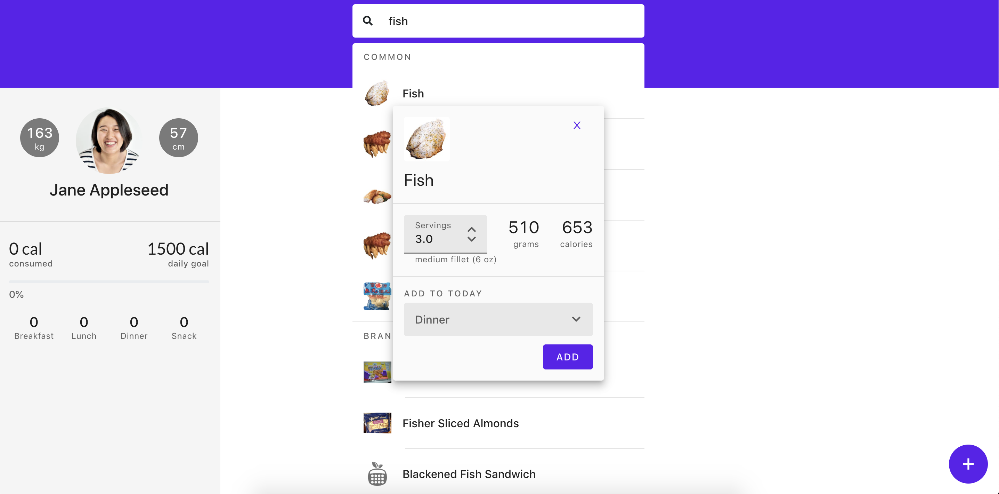
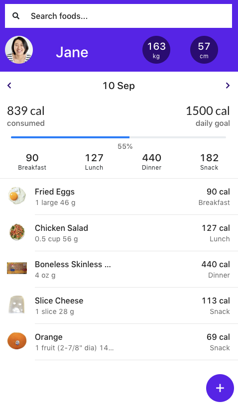

## Nutritionix API app
### `Live Demo:`
Open [https://sad-golick-ae9bfd.netlify.com](https://sad-golick-ae9bfd.netlify.com) to view in the browser.
 

### `Directions:`

Create a free account at [https://developer.nutritionix.com/](https://developer.nutritionix.com/) to get free Nutritionix API keys.
 
Create .env file in the project folder with the following format:
 
 
REACT_APP_X_API_ID="...your API id"
 
REACT_APP_X_API_KEY="...your API key"
 
 
From the project directory run:
 
## `npm i and npm start`
 

Open [http://localhost:3000](http://localhost:3000) to run in the browser
 
 

### `Description:`
This app uses the Nutritionix API to get food information such as serving sizes, calories, grams per serving etc. and allows the user to add food items to their daily total. The app then displays the user's daily consumed calories against their daily goal calories.
 
 

### `Screenshots:`

 
 

  

